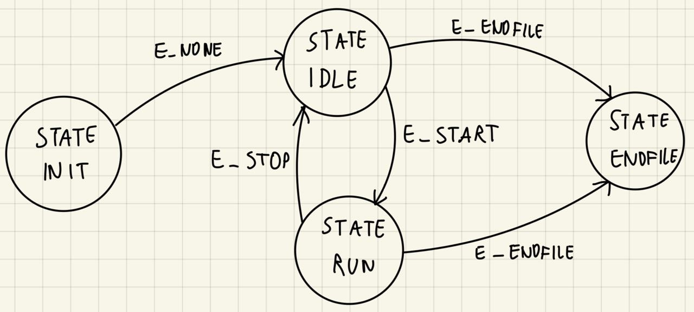

## Telemetry - project 2

Link: [instruction](eagle_readme.md)

### Structure
The project is structured in this way:
- `main.cpp`: contains the main function and the finite state machine
- `./include`: contains the header files
- `./src`: contains the source files
- `./media`: contains the media files


### Concept
The project is based on a multithreaded finite state machine.

The state machine is implemented in the file `main.cpp` with the structure `StateMachine_t`.

The structure contains a variable `state` of type `State_t` and a function pointer of type `void (*state_function)(void)`.
For each state, there is a function that is called when the state is entered.

```c++
typedef struct{
    State_t state;
    void (*state_function)();
} StateMachine_t;
```

The `current_state` variable is global, and its access is protected by a mutex `LockMutex` during its access.

This mutex will be also used to have a mutual exclusion on the access to the function `can_receive()` that is used to read the candump file.

In addition to that, there is a event variable `event` of type `Event` that is used to signal the state machine that an event has occurred.
The schema of the state machine is shown below.  

### Schema

Where the circles are the states and the arrows are the events.
For each state there is a function that is called when the state is entered.
```c++
StateMachine_t fsm[] = {
        {STATE_INIT, fn_INIT},
        {STATE_IDLE, fn_IDLE},
        {STATE_RUN, fn_RUN},
        {STATE_ENDFILE, fn_ENDFILE}
};
```

### How it works
The finite state machine (fsm) is initialized with the event `E_NONE` and the `STATE_INIT`. Then the function `fn_INIT()` is called.

This function will change the state to `STATE_IDLE` and the loop of the fsm will start (the one between `STATE_IDLE` and `STATE_RUN`).

The `fn_IDLE()` function calls the `idleThread()` function in the main thread.

The `idleThread()` function will check the output of the can_receive() function and if the output is -1, the event `E_ENDFILE` will be set.

Otherwise, the function `parse` will be called and it will print the message payload on the screen, converted to decimal format.

After this, it will be checked if the event `E_START` has occurred.
In this case the state will be changed to `STATE_RUN` and the function `fn_RUN()` will be called.

The `fn_RUN()` function will execute the `runThread()` function in a second thread and after it will be checked if the event `E_STOP` has occurred.

In this case the state will be changed to `STATE_IDLE` and the function `fn_IDLE()` will be called again.


Everytime is running, the `parse` function check if the message is a start or stop message and if it is, the event `E_START` or `E_STOP` will be set.
If is set the event `E_START` the function `fn_RUN()` will be called.

The function `fn_RUN()`, as just said, will call the `runThread()` function in a second thread.
This function will call again the `parse` function and the message will be also written in a file with the `log` function, adding the timestamp before the message.

Additionally, a csv file will be created with the statistics of the messages received everytime the event `E_STOP` is set.

When, during the execution of the state machine, the function `can_receive()` returns -1 (considering that most of the time this function returns the value of -1 when at the end of the file), event is set to `E_ENDFILE`, and the state machine is stopped. The program is then terminated.

### What can be changed and why I chose to do it in this way
1. I decided to create the function `hexToDec()` to convert the payload of the message from hexadecimal to decimal format. I could have also used the `std::hex` function, but I preferred to create a function to do this.
2. I decided to structure the fsm in this way, but I could have also used a switch case structure, or using the OOP paradigm, creating a class for the fsm and a class for the states; I could also use internal methods of the class to change the state and create a specific class for this fsm that inherits from the class of the fsm.
3. I decided to name the txt file with the timestamp in order to have a unique name for each file. I could have also used a counter to do so, like the solution I used for the csv file.